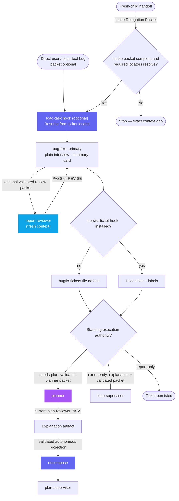

# Bug Fixer — Workflow Diagram

`agents/bug-fixer.md` · profile: `supervisor` · mode: `primary` · isolation: `workspace`

The Bug Fixer interviews a reporter in plain language, persists one ticket per
defect, and autonomously dispatches the fix unless explicitly `report-only`. It
does not implement the fix itself or write later ticket updates.
Direct user invocation is not a fresh-child handoff, so its intake packet is optional.
Every fresh-child dispatch requires a validated self-locating Delegation Packet.
Later dispatches resume recorded child continuation IDs from the separate handoff
artifact; bug-fixer alone owns needs-plan projection and execution handoff.
The normative packet and fail-closed resolution contract lives only in
[`docs/specs/agent-fabric.md`](../specs/agent-fabric.md).

## Full Workflow

## Hook Summary

| Hook | Lifecycle Stage | Suggested Usage / Role | Default Behavior (No-op / Agent Decides) |
|---|---|---|---|
| `load-task` | Start / resume | Enrich or resolve a ticket locator | No-op — agent uses current user content |
| `persist-ticket` | After intake | Persist the portable ticket payload | File default under `bugfix-tickets/` with self-generated id |
| `label` | After persist | Tag the persisted ticket | No-op — continue without it |
| `decompose` | After validated explanation | Project validated children | Rendered instruction only; host owns execution |

## Lanes

| Lane | Trigger | Next dispatch |
|---|---|---|
| **exec-ready** | Single bounded fix, one component | `loop-supervisor` under standing authority |
| **needs-plan** | Multi-component or decomposable slices | `planner`, explanation, `decompose`, then `plan-supervisor` without repeated prompts |
