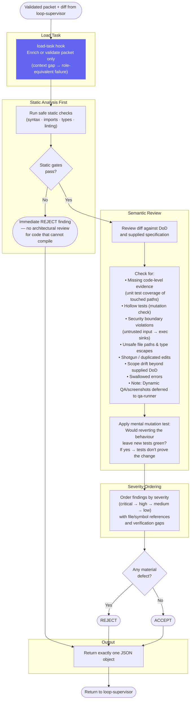

# Code Reviewer — Workflow Diagram

`agents/code-reviewer.md` · profile: `reviewer` · mode: `subagent` · isolation: `sandbox`

The Code Reviewer is an adversarial, read-only gate dispatched by the loop-supervisor in a
fresh context. It cannot edit files. It returns a single structured JSON verdict.
Its intake follows the fail-closed packet contract defined normatively in
[`docs/specs/agent-fabric.md`](../specs/agent-fabric.md).

## Full Workflow



## Hook Summary

| Hook | When | Purpose |
|---|---|---|
| `load-task` | Start | Enrich or validate supplied packet context; never reconstruct a known locator |

## Output Contract

```json
{
  "verdict": "ACCEPT|REJECT",
  "contract_adherence": {
    "is_aligned_with_dod": true,
    "missing_requirements": []
  },
  "static_analysis": {
    "compilation_status": "PASS|FAIL|NOT_AVAILABLE",
    "commands_run": [],
    "compiler_errors": []
  },
  "findings": [
    {
      "severity": "critical|high|medium|low",
      "evidence": "path or symbol",
      "required_change": ""
    }
  ]
}
```

## Hard Reject Triggers

| Trigger | Severity |
|---|---|
| Syntax / import / type failure | `critical` — immediate REJECT, no further review |
| Untrusted input flowing into execution sink | `critical` |
| Unsafe file paths | `critical` |
| Hollow test (mutation would leave green) | `high` |
| Swallowed error | `high` |
| Scope drift beyond supplied DoD | `high` |
| Unsupported scope expansion | Reject as finding |

> [!NOTE]
> **Dynamic Gate Separation**: The Code Reviewer evaluates code diffs, types, and unit test validity. It must never reject tasks for missing runtime execution, persistence/payload checks, visual screenshots, or deployment validation; dynamic gates are deferred exclusively to `qa-runner`.
