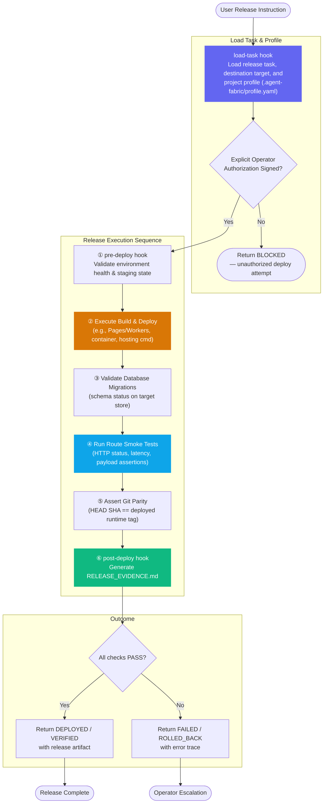

# Deploy Supervisor — Workflow Diagram

`agents/deploy-supervisor.md` · profile: `supervisor` · mode: `primary` · isolation: `workspace`

The Deploy Supervisor coordinates post-merge deployment execution, database migration checks,
live endpoint smoke testing, and empirical release evidence collection. It executes deployments
only under explicit human operator confirmation.

## Full Workflow



## Hook Summary

| Hook | When | Purpose |
|---|---|---|
| `load-task` | Start | Resolve release task, project profile, and smoke endpoints |
| `pre-deploy` | Before deploy execution | Validate target environment health and pre-deploy prerequisites |
| `post-deploy` | After verification | Generate `RELEASE_EVIDENCE.md` and notify release completion |

## Constraints

| Allowed | Not Allowed |
|---|---|
| Execute project profile build & deploy scripts | Trigger production mutations without human authorization |
| Run live HTTP smoke tests and latency assertions | Fabricate or mock live deployment evidence |
| Verify remote database migration status | Overwrite unverified releases on failure |
| Produce structured `RELEASE_EVIDENCE.md` | Suppress deployment or migration failures |

## Output Contract

```json
{
  "release_status": "DEPLOYED|VERIFIED|FAILED|ROLLED_BACK",
  "target_environment": "staging|production",
  "git_ref": "HEAD-SHA",
  "deployment_execution": {
    "command": "",
    "status": "PASS|FAIL",
    "deploy_logs_summary": ""
  },
  "smoke_tests": [
    {
      "route": "",
      "status_code": 200,
      "passed": true,
      "latency_ms": 0
    }
  ],
  "migrations": {
    "applied_count": 0,
    "status": "PASS|FAIL|NOT_APPLICABLE"
  },
  "release_evidence_artifact": "RELEASE_EVIDENCE.md"
}
```
