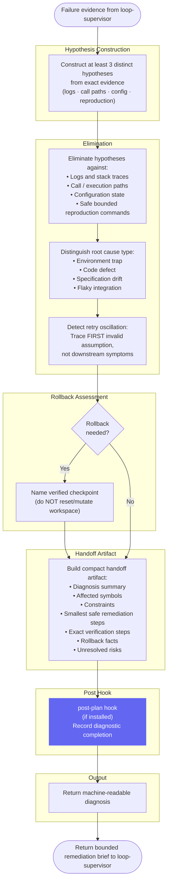

# Expert Debugger — Workflow Diagram

`agents/expert-debugger.md` · profile: `readonly` · mode: `subagent` · isolation: `sandbox`

The Expert Debugger diagnoses hard failures and produces a bounded root-cause remediation brief.
It cannot modify files or invent task-system state. It is invoked by the loop-supervisor
during bounded recovery.

## Full Workflow



## Hook Summary

| Hook | When | Purpose |
|---|---|---|
| `post-plan` | After diagnostic handoff | Notify / record diagnostic completion |

## Constraints

| Allowed | Not Allowed |
|---|---|
| Run safe bounded reproduction commands | Modify any product files |
| Read logs, traces, configuration | Reset or clean workspace |
| Name a verified rollback checkpoint | Invent task-system state |
| Return bounded remediation brief | Apply the fix itself |
| Use `bash` to inspect only | Stash, checkout, or overwrite unknown changes |

## Output Contract

```json
{
  "failure_classification": "infinite_loop|cascading_error|silent_tool_failure|environment_drift|quality_bypass",
  "root_cause_analysis": {
    "culprit": "",
    "chronology": "",
    "blockers": []
  },
  "tactical_intervention": {
    "remediation_type": "surgical_patch|rollback|environment_reset",
    "rollback_target": null,
    "instructions": "",
    "handoff_artifact": ""
  },
  "suggested_worker_overrides": {
    "poka_yoke_rules": [],
    "required_checks": []
  }
}
```

## Investigation Principle

> Trace execution **backward** to the first invalid state or assumption — not to the most
> visible symptom. Inspect repeated attempts for oscillation, environment drift, swallowed
> failures, and test bypasses.
