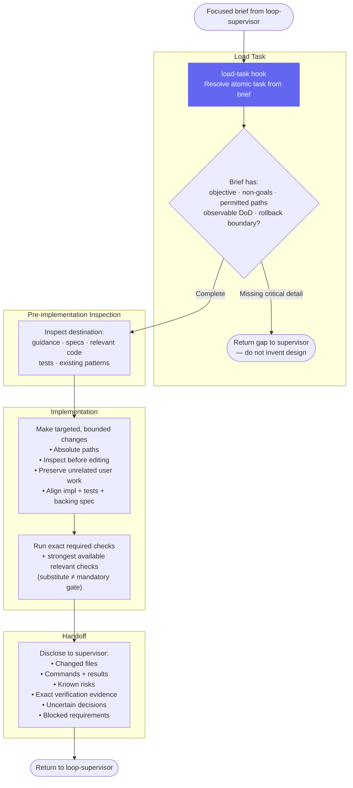

# Implementor — Workflow Diagram

`agents/implementor.md` · profile: `worker` · mode: `subagent` · isolation: `sandbox`

The Implementor makes bounded, targeted code changes for one atomic task. It is dispatched
by the loop-supervisor, hands off only to its supervisor, and never self-certifies.

## Full Workflow

## Hook Summary

| Hook | When | Purpose |
|---|---|---|
| `load-task` | Start | Resolve atomic task brief; validate task completeness before editing |

## Scope Constraints

| Allowed | Not Allowed |
|---|---|
| File edits within permitted paths | Committing or deploying changes |
| Running required checks | Authenticating with external services |
| Reporting evidence to supervisor | Starting long-lived services (unless explicitly granted) |
| Running strongest available additional checks | Redefining product architecture |
| | Silently broadening scope |
| | Handing off to anyone other than the supervisor |

## Authority Boundary

The implementor hands off **only to the loop-supervisor**. It does not dispatch code-reviewer or
qa-runner directly — the supervisor owns fresh-context review dispatch and the final verdict.
