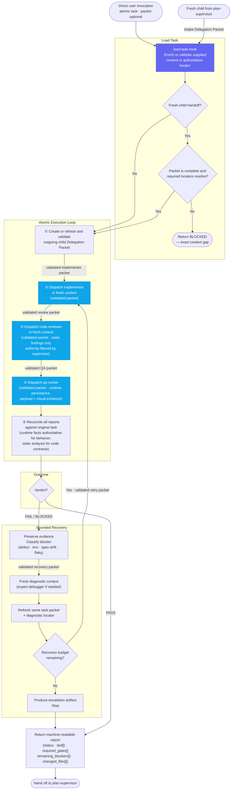
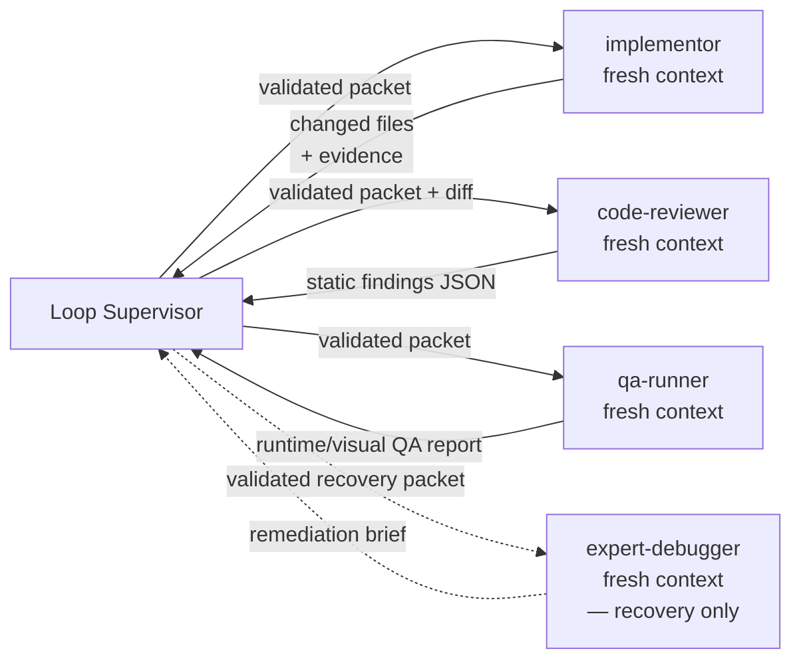

# Loop Supervisor — Workflow Diagram

`agents/loop-supervisor.md` · profile: `supervisor` · mode: `all` · isolation: `workspace`

The Loop Supervisor drives one atomic task through implementation, review, testing, and
DoD validation. It owns the control loop and evidence integrity; it never self-certifies work.
Direct user invocation is not a fresh-child handoff, so its intake packet is optional.
Every fresh-child arrow below is labelled with its validated self-locating Delegation Packet.
The normative packet and fail-closed resolution contract lives only in
[`docs/specs/agent-fabric.md`](../specs/agent-fabric.md).

## Full Workflow



## Delegation Model



## Hook Summary

| Hook | When | Purpose |
|---|---|---|
| `load-task` | Start | Resolve and validate atomic task; block if design gap |
| `record-ledger` | State transitions | Record structured micro-ledger event to host memory or fallback JSONL |
| `pre-delegate-implementor` | Before implementor | Optional task-specific preparation |
| `post-delegate-implementor` | After implementor | Optional result handling before review |
| `pre-delegate-code-reviewer` | Before code review | Optional task-specific preparation |
| `post-delegate-code-reviewer` | After code review | Optional finding handling before QA |
| `pre-delegate-qa-runner` | Before QA | Optional task-specific preparation |
| `post-delegate-qa-runner` | After QA | Optional evidence handling before reconciliation |
| `pre-delegate-expert-debugger` | Before diagnostic | Optional recovery preparation |
| `post-delegate-expert-debugger` | After diagnostic | Optional remediation-brief handling |

The delegation lifecycle hooks are no-ops unless installed. Their placeholders
are removed during rendering, so a default generated agent is unchanged. Per the
normative spec, an installed hook may enrich or validate a packet but cannot
reconstruct a known locator.

## Micro-Ledger & Curation Firewall

The Loop Supervisor maintains an atomic micro-ledger across task iterations and acts as an unbiased
Curation Firewall across all subagent dispatches:

- **Implementor Packets:** Forward only objective finding definitions (`F1: lease boundary equality in path:line`) and failing test gates; strip subjective reviewer rhetoric.
- **Code Reviewer Packets:** Forward only remediation diff and objective criteria to verify ("Verify whether finding F1 is resolved, without regressions"); suppress developer rationalizations or apologies.
- **QA Runner Packets:** Forward strictly original DoD, test commands, and workspace changes; filter out subjective code-quality opinions.
- **Expert Debugger Packets:** Forward strictly objective failing gate/test logs, breached contracts, and diffs; filter out conversational history.

```json
{
  "tier": "micro",
  "task_id": "<atomic-task-id>",
  "iteration": 1,
  "phase": "implementation|code_review|qa|diagnostic|reconciliation",
  "status": "PASS|FAIL|BLOCKED",
  "mutation_count": 1,
  "review_rejections": 0,
  "findings": [
    {
      "id": "F1",
      "classification": "new|repeat|scope_blocker",
      "severity": "critical|high|medium|low",
      "breached_contract": "<contract-or-dod-item>",
      "evidence": "<path:line>",
      "required_change": "<objective-fix>"
    }
  ],
  "remediation_targets": ["<file:line>"],
  "timestamp": "<iso-8601-utc>"
}
```

## Output Contract

```json
{
  "status": "PASS|FAIL|BLOCKED",
  "dod": [{"item": "original DoD", "status": "PASS|FAIL|BLOCKED", "evidence": "authoritative locator or command"}],
  "required_gates": [{"command": "exact command", "status": "PASS|FAIL|BLOCKED", "evidence": "authoritative locator"}],
  "remaining_blockers": [],
  "changed_files": []
}
```

`PASS` requires every original DoD item and every mandatory gate to have concrete passing evidence.
