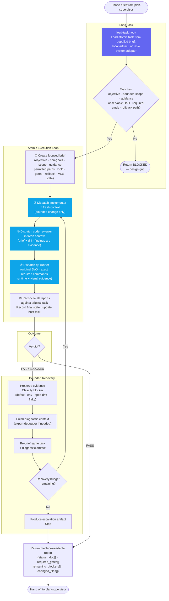
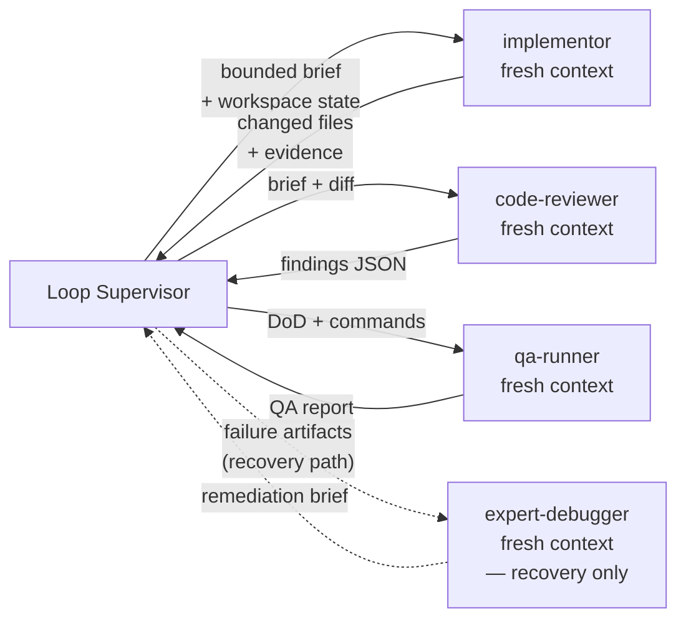

# Loop Supervisor — Workflow Diagram

`agents/loop-supervisor.md` · profile: `supervisor` · mode: `all` · isolation: `workspace`

The Loop Supervisor drives one atomic task through implementation, review, testing, and
DoD validation. It owns the control loop and evidence integrity; it never self-certifies work.

## Full Workflow



## Delegation Model



## Hook Summary

| Hook | When | Purpose |
|---|---|---|
| `load-task` | Start | Resolve and validate atomic task; block if design gap |

## Output Contract

```json
{
  "status": "PASS|FAIL|BLOCKED",
  "dod": [{"item": "original DoD", "status": "PASS|FAIL|BLOCKED", "evidence": "path or command"}],
  "required_gates": [{"command": "exact command", "status": "PASS|FAIL|BLOCKED", "evidence": "path"}],
  "remaining_blockers": [],
  "changed_files": []
}
```

`PASS` requires every original DoD item and every mandatory gate to have concrete passing evidence.
