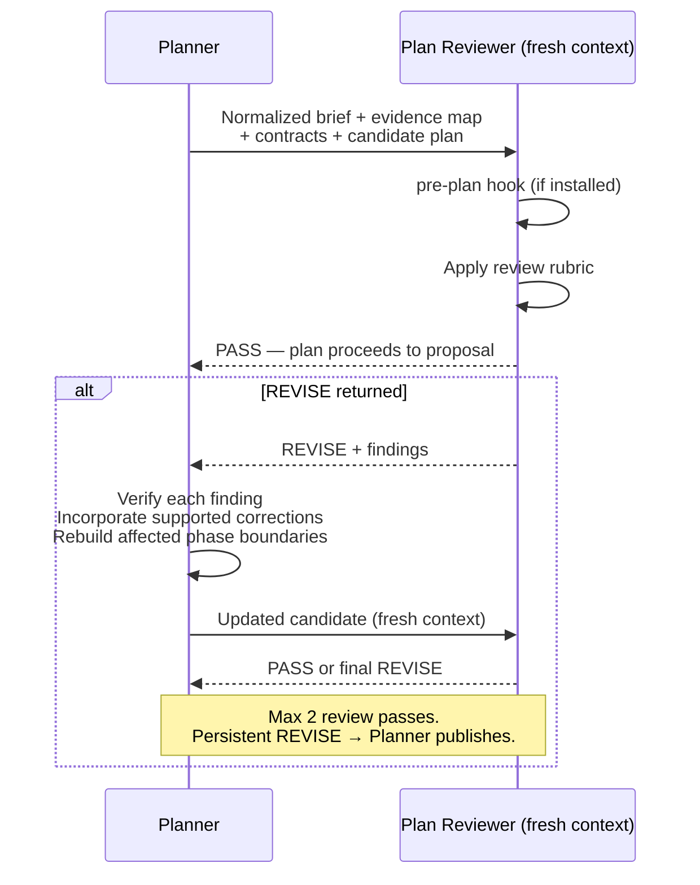

# Plan Reviewer — Workflow Diagram

`agents/plan-reviewer.md` · profile: `reviewer` · mode: `subagent` · isolation: `sandbox`

The Plan Reviewer independently validates implementation plans for completeness, dependency
correctness, safety, and testable completion criteria. It is dispatched by the Planner in a
**fresh context** with a minimal, sanitised package — no authoring transcripts or rejected drafts.

## Full Workflow

```mermaid
flowchart TD
    START(["Seed + evidence map + contracts\n+ candidate plan\n(from Planner — fresh context)"]) --> PP

    subgraph "Pre-Review Hook"
        PP["pre-plan hook\n(if installed)\nApply any validation prerequisites\nbefore reviewing the candidate"]
    end

    PP --> REVIEW

    subgraph "Review Rubric"
        REVIEW["Review candidate plan using\nonly the provided package\n(no scope expansion · no prose improvement)"]

        INTENT["① Intent alignment\nDoes the plan match the seed?"]
        GROUNDING["② Source grounding\nAre all claims traceable to evidence?"]
        SHAPE["③ Vertical-slice shape\nEach phase cuts across all required layers?"]
        DELEG["④ Atomic delegability\nEach phase independently workable\nwith no hidden design decisions?"]
        DEPS["⑤ Acyclic minimal dependencies\nNo circular deps · no unnecessary ordering?"]
        EXEC["⑥ Execution fields\nConcrete paths · commands · gate criteria?"]
        ROLLBACK["⑦ Rollback and risk\nEach phase has a rollback seam + stated risks?"]
        CLASS["⑧ Operator-required classification\nEvery non-autonomous phase explicitly justified?"]
        DOD["⑨ Observable DoD\nEach phase has testable, inspectable completion criteria?"]
    end

    REVIEW --> INTENT --> GROUNDING --> SHAPE --> DELEG
    DELEG --> DEPS --> EXEC --> ROLLBACK --> CLASS --> DOD --> MUTTEST

    subgraph "Coverage Check"
        MUTTEST["Check coverage status\n(PASS · FAIL · NOT_AVAILABLE)\nNote gaps — do not block on NOT_AVAILABLE\nunless coverage is required by the plan"]
    end

    MUTTEST --> SEVERITY

    subgraph "Severity Assessment"
        SEVERITY["Classify each finding:\ncritical · high · medium · low\n\nReject stylistic preference as a finding\nunless it harms the stated contract"]

        VERDICT{Any critical or\nhigh-severity defect?}
    end

    SEVERITY --> VERDICT
    VERDICT -- No --> PASS([PASS\n— plan may proceed to proposal])
    VERDICT -- Yes --> REVISE([REVISE\n— evidence-based findings returned\nto Planner])

    style PP fill:#a855f7,color:#fff,stroke:none
```



## Hook Summary

| Hook | When | Purpose |
|---|---|---|
| `pre-plan` | Before reviewing | Apply any validation prerequisites defined by the host environment |

## Input Package (strict)

The Plan Reviewer receives **only**:
- Normalized brief / seed
- Evidence map
- Applicable contracts and coverage findings
- Complete candidate plan

It must **not** receive: authoring transcripts, hidden reasoning, or rejected drafts.

## Output Contract

```json
{
  "verdict": "PASS|REVISE",
  "summary": "",
  "coverage": {
    "status": "PASS|FAIL|NOT_AVAILABLE",
    "gaps": []
  },
  "phase_assessments": [
    {
      "phase": "",
      "vertical_slice": "PASS|FAIL|NOT_APPLICABLE",
      "independently_delegable": "PASS|FAIL",
      "dependency_valid": "PASS|FAIL",
      "dod_testable": "PASS|FAIL"
    }
  ],
  "findings": [
    {
      "severity": "critical|high|medium|low",
      "category": "",
      "phase": "",
      "evidence": "",
      "defect": "",
      "required_change": ""
    }
  ],
  "confidence": 0.0
}
```

## Planner–Reviewer Interaction


