# Plan Supervisor — Workflow Diagram

`agents/plan-supervisor.md` · profile: `supervisor` · mode: `primary` · isolation: `workspace`

The Plan Supervisor executes a pre-decomposed implementation plan phase-by-phase through bounded
task supervision. It owns phase ordering and evidence integrity; the phase loop
is the sole recovery owner. Load the macro checkpoint before phase selection.
Fresh-child arrows abbreviate the Delegation Packet contract defined normatively in
[`docs/specs/agent-fabric.md`](../specs/agent-fabric.md).
Direct user invocation is not a fresh-child handoff, so its intake packet is optional.

## Full Workflow

```mermaid
flowchart TD
    DIRECT([Direct user invocation\napproved plan · packet optional])
    FRESH([Fresh-child handoff])
    DIRECT --> LT
    FRESH -->|"intake Delegation Packet"| INTAKE
    INTAKE{"Intake packet complete and\nrequired locators resolve?"}
    INTAKE -- No --> BLOCKED_INTAKE([Return BLOCKED\n— exact context gap])
    INTAKE -- Yes --> LT

    subgraph "Load & Validate"
        LT["① load-task hook\nLoad explicit plan content or locator\noptionally via task system → build DAG"]
        PREVAL["pre-plan hook\nValidate source plan\n(if installed)"]
        DEC["decompose hook\nMaterialize phases if needed\n(if installed)"]
    end

    LT --> PREVAL --> DEC

    subgraph "Phase Selection Loop"
        SEL["② Select unblocked phase\nwith all predecessor evidence ready"]
        BRIEF["Write and validate\nself-locating phase packet"]
        DISPATCH["③ Resume recorded loop-supervisor\nnew session only on new resolving authority / approved scope identity change / unavailable recorded continuation\ncontext length: resume or BLOCKED\nvalidated packet + checkpoint"]
    end

    DEC --> SEL --> BRIEF
    BRIEF -->|"validated phase packet"| DISPATCH

    subgraph "Evidence Verification"
        VERIFY["④ Verify phase evidence\n• Every DoD item PASS with\n  inspectable evidence\n• Record VCS revision"]
        RESULT{Phase result?}
    end

    DISPATCH --> VERIFY --> RESULT

    subgraph "Recovery"
        FAIL_CLASS["Classify failure\nenvironment · defect · spec-drift · flaky"]
        DIAG["Consume child diagnosis + checkpoint\nno second diagnostic at parent level"]
        STRUCT{"Structurally overbroad\nafter diagnostic?"}
        CAP_SPLIT{"Strict DoD-preserving\npartition exists?"}
        FREEZE["Freeze failed checkpoint\nReturn to stable revision"]
        SPLIT["Materialize deterministic slices\nwith decompose hook or inline DAG"]
        AGG["Original phase becomes\naggregate acceptance gate"]
        REBR["Refresh same phase packet\n+ diagnostic locator\nincrement attempt count"]
        EXHAUST{Recovery budget\nexhausted?}
        EXTERNAL{"No DoD-preserving split\nand verified external gate?"}
        ESCALATE["Write PLAN_ESCALATION.md\n(attempts · root-cause · stable/failed revs\nrequired external action)"]
    end

    RESULT -- "FAIL / BLOCKED" --> FAIL_CLASS
    FAIL_CLASS -->|"validated recovery packet"| DIAG
    DIAG --> STRUCT
    STRUCT -- Yes --> FREEZE
    STRUCT -- No --> REBR --> EXHAUST
    EXHAUST -- "No · refreshed phase packet" --> DISPATCH
    EXHAUST -- Yes --> CAP_SPLIT
    CAP_SPLIT -- Yes --> FREEZE --> SPLIT --> AGG --> DEC
    CAP_SPLIT -- No --> EXTERNAL
    EXTERNAL -- No --> DONE_FAIL([Atomic phase failed with evidence])
    EXTERNAL -- Yes --> ESCALATE --> DONE_BLOCKED([Plan blocked / escalated])

    subgraph "Phase Completion"
        LBL["⑤ label hook\nRecord phase state in task-system\n(if installed)"]
        MORE{All phases\ncomplete?}
    end

    RESULT -- PASS --> LBL --> MORE
    MORE -- "No — next eligible phase" --> SEL
    MORE -- "Yes (all phases PASS)" --> DONE_OK([Plan complete])

    style LT fill:#6366f1,color:#fff,stroke:none
    style PREVAL fill:#a855f7,color:#fff,stroke:none
    style DEC fill:#6366f1,color:#fff,stroke:none
    style LBL fill:#6366f1,color:#fff,stroke:none
```



## Hook Summary

| Hook | Step | Purpose |
|---|---|---|
| `load-task` | 1 | Resolve plan source; build phase DAG |
| `pre-plan` | Pre-dispatch | Validate source plan before any mutation |
| `decompose` | Pre-dispatch and structural recovery | Materialize initial or replacement phases into task-system (if installed); otherwise update inline DAG |
| `label` | After each PASS | Record phase state in task-system |
| `record-ledger` | Before selection/dispatch and after return | Load checkpoint; record event + checkpoint with expected_version |

## Macro-Ledger & Phase Curation Firewall

The Plan Supervisor coordinates phase execution across the plan DAG and maintains a macro-ledger
at all phase transitions (`PENDING` -> `IN_PROGRESS` -> `DONE` or `BLOCKED`).

The Plan Supervisor acts as a curation firewall between phases:
- Outgoing phase packets contain strictly objective contracts, verified prerequisite outputs from the macro-ledger, and required acceptance gates.
- Subjective debates, prior phase debugging trails, or implementor rationalizations are strictly suppressed to prevent context pollution and cross-phase bias.

```json
{
  "tier": "macro",
  "plan_id": "<parent-task-or-plan-id>",
  "phase_id": "<phase-id>",
  "objective": "<phase-objective>",
  "summary": "<phase-status-summary>",
  "dependencies": ["<dep-phase-id>"],
  "status": "PENDING|IN_PROGRESS|DONE|BLOCKED",
  "revision": "<git-commit-hash>",
  "timestamp": "<iso-8601-utc>",
  "blockers": []
}
```

## Autonomous Boundaries

| Condition | Behaviour |
|---|---|
| Successful non-final phase | Continue immediately — no human pause |
| Phase explicitly `operator-required` | Pause and wait for human action |
| Recovery budget exhausted | Evaluate stable-base split; if still atomic, terminal FAIL with exhausted disposition |
| No DoD-preserving split and verified external gate | Produce `PLAN_ESCALATION.md`; stop |
| Irreversible mechanics within scope | Apply proportional controls; stop only for a verified external boundary or terminal failure |

## Evidence Contract (per phase)

```json
{
  "status": "PASS|FAIL|BLOCKED",
  "recovery": {"mode": "none|retry|split|exhausted|external_block", "stable_revision": "...", "failed_revision": "...", "replacement_slices": [{"scope_id": "deterministic-id", "dod": ["original item"], "required_gates": ["command"], "dependencies": [], "permitted_paths": ["path"], "initial_attempts": {"mutating": 0}}]},
  "dod": [{"item": "...", "status": "PASS|FAIL|BLOCKED", "evidence": "authoritative locator or command"}],
  "required_gates": [{"command": "...", "status": "...", "evidence": "authoritative locator"}],
  "remaining_blockers": [],
  "changed_files": []
}
```

The plan supervisor integrates accepted slice outputs into one recorded revision;
dependent slices consume verified predecessor changes. Aggregate acceptance runs
against that integrated revision. Exhausted atomic scopes are not redispatched.
