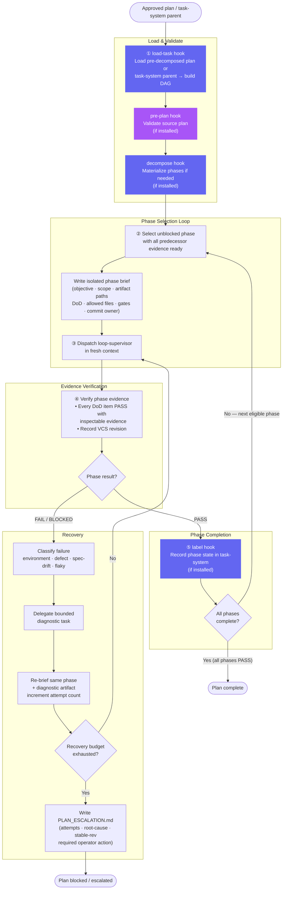

# Plan Supervisor — Workflow Diagram

`agents/plan-supervisor.md` · profile: `supervisor` · mode: `primary` · isolation: `workspace`

The Plan Supervisor executes a pre-decomposed implementation plan phase-by-phase through bounded
task supervision. It owns phase ordering, evidence integrity, and bounded recovery.

## Full Workflow



## Hook Summary

| Hook | Step | Purpose |
|---|---|---|
| `load-task` | 1 | Resolve plan source; build phase DAG |
| `pre-plan` | Pre-dispatch | Validate source plan before any mutation |
| `decompose` | Pre-dispatch | Materialize phases into task-system (if needed) |
| `label` | After each PASS | Record phase state in task-system |

## Autonomous Boundaries

| Condition | Behaviour |
|---|---|
| Successful non-final phase | Continue immediately — no human pause |
| Phase explicitly `operator-required` | Pause and wait for human action |
| Recovery budget exhausted | Produce `PLAN_ESCALATION.md`; stop |
| Irreversible environment / authority failure | Stop; preserve evidence |

## Evidence Contract (per phase)

```json
{
  "status": "PASS|FAIL|BLOCKED",
  "dod": [{"item": "...", "status": "PASS|FAIL|BLOCKED", "evidence": "path or command"}],
  "required_gates": [{"command": "...", "status": "...", "evidence": "..."}],
  "remaining_blockers": [],
  "changed_files": []
}
```
