# Planner — Workflow Diagram

`agents/planner.md` · profile: `planner` · mode: `primary` · isolation: `sandbox`

The Planner authors grounded, independently reviewed implementation plans as executable vertical
slices. It never executes phases or treats a proposal as approval.

A concurrently loaded host skill (interview, artifact, or documentation skill) augments a single
workflow step but never replaces the plan deliverable: the workflow stays incomplete until the
canonical plan body is written at the proposal boundary or a Publish-mode write completes.

The canonical body also includes a planner-mode system reminder that reinforces this boundary and
prevents companion skill artifacts from being mistaken for implementation.

## Full Workflow

```mermaid
flowchart TD
    START([User / Task Seed]) --> LT

    subgraph "Initial Understanding"
        LT["① load-task hook (optional)\nResolve seed from request,\nexplicit file, or task-system item"]
        READ["② Read destination guidance\nSpecs · ADRs · tests · patterns"]
        MAP["③ Map affected surfaces\nEntry points · contracts · data flow\npersistence · UI/API · rollback seams"]
        GAPS["④ Delegate bounded discovery\nor design questions (if needed)"]
        BRIEF["⑤ State objective, non-goals,\ncurrent behavior, destination,\nconstraints, and decision-critical gaps"]
        PP["⑥ pre-plan hook (optional)\nLoad schema, DoD templates,\nvalidation rules & constraints"]
    end

    LT --> READ --> MAP --> GAPS --> BRIEF --> PP

    subgraph "Design"
        DESIGN["Design smallest coherent approach\n• Vertical slices (not horizontal layers)\n• Prefactor only when needed for safety\n• Minimal, acyclic dependencies\n• Each phase independently delegable\n• Visual acceptance criteria for UI"]
    end

    PP --> DESIGN

    subgraph "Independent Review"
        WRITE{Explicit write?}
        REVIEWER["Spawn plan-reviewer\nin fresh context\n(default cap: two passes)"]
        VERDICT{Reviewer verdict?}
        REVISE["Incorporate supported\ncorrections · rebuild\naffected phase boundaries"]
        CAP{Second pass done?}
    end

    DESIGN --> WRITE
    WRITE -- Yes --> PROPOSE
    WRITE -- No --> REVIEWER
    REVIEWER --> VERDICT
    VERDICT -- PASS --> PROPOSE
    VERDICT -- REVISE --> REVISE --> CAP
    CAP -- No --> REVIEWER
    CAP -- Yes --> PROPOSE

    subgraph "Proposal Boundary"
        PROPOSE["Write canonical plan body\n(Phase-block form)"]
        PPOST["post-plan hook (optional)\nPublish / notify / trigger downstream"]
    end

    PROPOSE --> PPOST --> READY([Plan ready for approval])
    READY --> AUTH{Explicit approval?}
    AUTH -- No --> DONE([Stop])
    AUTH -- Yes --> DEC["decompose hook (optional)\nHost-owned projection"]
    DEC --> PROJECTED([Host-owned result])

    style LT fill:#6366f1,color:#fff,stroke:none
    style PP fill:#a855f7,color:#fff,stroke:none
    style REVIEWER fill:#0ea5e9,color:#fff,stroke:none
    style PPOST fill:#6366f1,color:#fff,stroke:none
    style DEC fill:#6366f1,color:#fff,stroke:none
```

## Hook Summary

| Hook | Lifecycle Stage | Suggested Usage / Role | Default Behavior (No-op / Agent Decides) |
|---|---|---|---|
| `load-task` | Initial Understanding (Step 1) | Enrich or resolve task seed from host issue tracker or custom format | No-op — agent resolves seed directly from prompt context |
| `pre-plan` | Pre-Design (Step 6) | Inject target plan schema, DoD templates, validation rules, constraints, or a host interview that replaces the default interview | No-op — agent uses the short default interview and canonical phase blocks |
| `post-plan` | Proposal Boundary | Emit plan publication events, notifications, or downstream task projection | No-op — agent completes proposal locally without external events |
| `decompose` | After explicit approval | Materialize the approved plan through the host task-system adapter | No-op — agent does not invent identifiers or project children |

## Operating Modes

| Mode | Trigger | Guard |
|---|---|---|
| **Author** | New goal, brief, file, or task seed | — |
| **Refine** | Eligible draft plan exists | Must still be a draft; not approved, projected, or blocked by children |
| **Publish** | User instructs writing the plan to the task system | Write the current candidate; skip remaining reviews and earlier hooks |
| **Approval / projection** | Explicit operator authorization | Requires stored body + auditable receipt |
