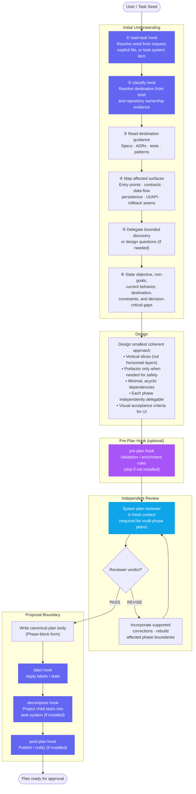

# Planner — Workflow Diagram

`agents/planner.md` · profile: `planner` · mode: `primary` · isolation: `sandbox`

The Planner authors grounded, independently reviewed implementation plans as executable vertical
slices. It never executes phases or treats a proposal as approval.

## Full Workflow

## Hook Summary

| Hook | When | Installed behaviour | Not installed |
|---|---|---|---|
| `load-task` | Step 1 | Custom task resolution / enrichment | Agent resolves seed from context |
| `classify` | Step 2 | Route to project · team · service catalog | Agent infers destination from evidence |
| `pre-plan` | Before proposal | Validation gate (blocks on reject) | Continue without validation |
| `label` | Proposal boundary | Apply task-system labels | No-op |
| `decompose` | Proposal boundary | Project phases as child tasks | No-op |
| `post-plan` | After proposal | Publish · notify · trigger downstream | No-op |

## Operating Modes

| Mode | Trigger | Guard |
|---|---|---|
| **Author** | New goal, brief, file, or task seed | — |
| **Refine** | Eligible draft plan exists | Must still be a draft; not approved, projected, or blocked by children |
| **Approval / projection** | Explicit operator authorization | Requires stored body + auditable receipt |
