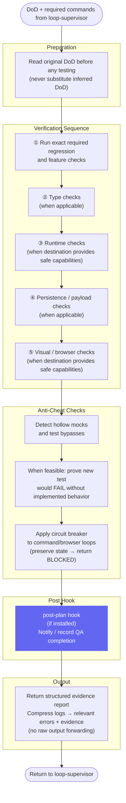

# QA Runner — Workflow Diagram

`agents/qa-runner.md` · profile: `qa` · mode: `subagent` · isolation: `sandbox`

The QA Runner performs deterministic and visual verification against the original DoD.
It cannot edit product files. It is dispatched by the loop-supervisor and returns a
structured evidence report.

## Full Workflow



## Hook Summary

| Hook | When | Purpose |
|---|---|---|
| `post-plan` | After QA report produced | Notify / signal QA completion to task-system or downstream |

## Constraints

| Allowed | Not Allowed |
|---|---|
| Run exact required commands | Edit product files |
| Run additional safe verification | Deploy |
| Capture screenshots / browser evidence | Hide or suppress failures |
| Compress logs into relevant evidence | Replace a required command with a narrower substitute |
| Return `BLOCKED` for budget-exhausted loops | Claim `PASS` without concrete per-item evidence |

## Output Contract

```json
{
  "outcome_verdict": "PASS|FAIL|BLOCKED",
  "contract_compliance": {
    "dod_verified": false,
    "satisfied_criteria": [],
    "unmet_criteria": []
  },
  "automated_tests": {
    "total_run": 0,
    "passed": 0,
    "failed": 0,
    "mutation_check": "PASS|FAIL|NOT_AVAILABLE",
    "raw_errors_summary": ""
  },
  "visual_e2e_testing": {
    "status": "PASS|FAIL|NOT_AVAILABLE",
    "screenshots_captured": [],
    "ui_bugs": []
  },
  "anti_cheat_logs": {
    "test_bypass_detected": false,
    "hollow_mocks_detected": false
  },
  "detailed_bug_report": {
    "summary": "",
    "execution_trace_log_path": ""
  }
}
```

A status code alone is never sufficient evidence — observable behaviour and relevant side
effects must be verified.
