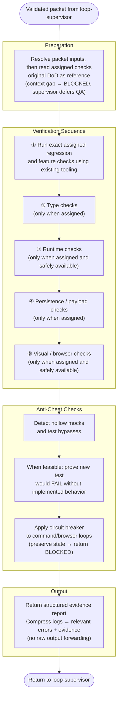

# QA Runner — Workflow Diagram

`agents/qa-runner.md` · profile: `qa` · mode: `subagent` · isolation: `sandbox`

The QA Runner verifies supervisor-assigned checks, with original DoD as reference.
It cannot implement product code, wrappers or tooling. QA is recommended, not
mandatory; loop-supervisor decides whether to dispatch and what evidence is needed.
Execution blockers are communicated upward as deferred QA without stopping implementation.
Its intake follows the fail-closed packet contract defined normatively in
[`docs/specs/agent-fabric.md`](../specs/agent-fabric.md).

## Full Workflow


```mermaid
flowchart TD
    START([Validated packet from loop-supervisor]) --> READDOD

    subgraph "Preparation"
        READDOD["Resolve packet inputs, then read assigned checks\noriginal DoD as reference\n(context gap → BLOCKED, supervisor defers QA)"]
    end

    READDOD --> REGRESSION

    subgraph "Verification Sequence"
        REGRESSION["① Run exact assigned regression\nand feature checks using existing tooling"]
        TYPE["② Type checks\n(only when assigned)"]
        RUNTIME["③ Runtime checks\n(only when assigned and safely available)"]
        PERSIST["④ Persistence / payload checks\n(only when assigned)"]
        VISUAL["⑤ Visual / browser checks\n(only when assigned and safely available)"]
    end

    REGRESSION --> TYPE --> RUNTIME --> PERSIST --> VISUAL --> ANTICHECK

    subgraph "Anti-Cheat Checks"
        ANTICHECK["Detect hollow mocks\nand test bypasses"]
        MUTATION["When feasible: prove new test\nwould FAIL without implemented behavior"]
        CIRCUIT["Apply circuit breaker\nto command/browser loops\n(preserve state → return BLOCKED)"]
    end

    ANTICHECK --> MUTATION --> CIRCUIT --> REPORT

    subgraph "Output"
        REPORT["Return structured evidence report\nCompress logs → relevant errors + evidence\n(no raw output forwarding)"]
    end

    REPORT --> DONE([Return to loop-supervisor])
```

## Hook Summary

No registered hooks.

## Constraints

| Allowed | Not Allowed |
|---|---|
| Run exact required commands | Edit product files |
| Run assigned verification (runtime, persistence, payload, visual) | Add acceptance predicates or engineer QA tooling |
| Capture screenshots / browser evidence | Produce code-quality or design reviews |
| Compress logs into relevant evidence | Hide or suppress failures |
| Circuit-break repeated loops with `FAIL` and a supervisor recovery request | Replace a required command with a narrower substitute |
| | Claim `PASS` without concrete per-item evidence |

## Output Contract

```json
{
  "outcome_verdict": "PASS|FAIL|BLOCKED|IN_PROGRESS",
  "verification_scope": "assigned checks only",
  "failure_kind": null,
  "unrun_checks": [],
  "contract_compliance": {
    "dod_verified": false,
    "satisfied_criteria": [],
    "unmet_criteria": []
  },
  "automated_tests": {
    "total_run": 0,
    "passed": 0,
    "failed": 0,
    "mutation_check": "PASS|FAIL|NOT_AVAILABLE",
    "raw_errors_summary": ""
  },
  "visual_e2e_testing": {
    "status": "PASS|FAIL|NOT_AVAILABLE",
    "screenshots_captured": [],
    "ui_bugs": []
  },
  "anti_cheat_logs": {
    "test_bypass_detected": false,
    "hollow_mocks_detected": false
  },
  "detailed_bug_report": {
    "summary": "",
    "execution_trace_log_path": ""
  }
}
```

A status code alone is never sufficient evidence — observable behaviour and relevant side
effects must be verified.
