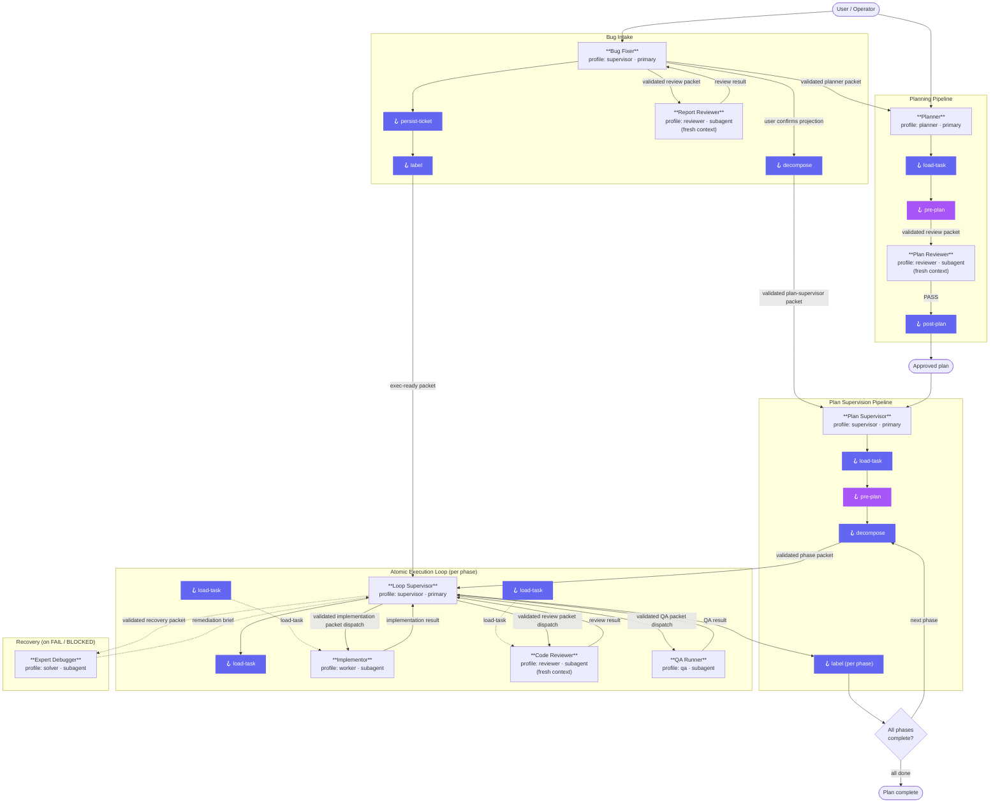

# Agent Fabric — System Architecture

This diagram shows how the built-in agents collaborate in the full intake → planning → execution
lifecycle, including hook event fire points and delegation relationships.
Every fresh-context delegation arrow carries the self-locating packet defined
normatively in [`docs/specs/agent-fabric.md`](../specs/agent-fabric.md); hooks may
enrich or validate that packet but never reconstruct known locators.

## Full System Diagram

## Agent Role Summary

| Agent | Profile | Mode | Isolation | Hooks |
|---|---|---|---|---|
| [Planner](planner.md) | `planner` | primary | sandbox | load-task · pre-plan · post-plan |
| [Plan Reviewer](plan-reviewer.md) | `reviewer` | subagent | sandbox | pre-plan |
| [Plan Supervisor](plan-supervisor.md) | `supervisor` | primary | workspace | load-task · pre-plan · label · decompose · record-ledger |
| [Loop Supervisor](loop-supervisor.md) | `supervisor` | all | workspace | load-task · record-ledger |
| [Implementor](implementor.md) | `worker` | subagent | sandbox | load-task |
| [Code Reviewer](code-reviewer.md) | `reviewer` | subagent | sandbox | load-task |
| [QA Runner](qa-runner.md) | `qa` | subagent | sandbox | — |
| [Expert Debugger](expert-debugger.md) | `solver` | subagent | sandbox | — |
| [Bug Fixer](bug-fixer.md) | `supervisor` | primary | workspace | load-task · label · persist-ticket · decompose |
| [Report Reviewer](bug-fixer.md) | `reviewer` | subagent | sandbox | — |

## Hook Event Reference

| Event | Registered by | Typical purpose |
|---|---|---|
| `load-task` | Planner · Plan Supervisor · Loop Supervisor · Implementor · Code Reviewer | Enrich or validate supplied task packet context |
| `pre-plan` | Planner · Plan Supervisor · Plan Reviewer | Validation gate and schema/constraint loading before planning or review begins |
| `classify` | — (reserved; no built-in agent registers it) | Route to destination / select next unblocked phase |
| `label` | Plan Supervisor · Bug Fixer | Apply task-system labels or state transitions |
| `persist-ticket` | Bug Fixer | Persist a portable bug ticket; file default when uninstalled |
| `decompose` | Plan Supervisor · Bug Fixer | Project child phases into task-system |
| `post-plan` | Planner | Signal completion / publish / notify |
| `record-ledger` | Plan Supervisor · Loop Supervisor | Record structured macro- or micro-ledger event to host memory or fallback JSONL |

Hooks are resolved once at install/sync time from `~/.agent-hooks/`. Markdown instructions
take precedence over executable scripts. When no hook is installed, agents continue without it.
