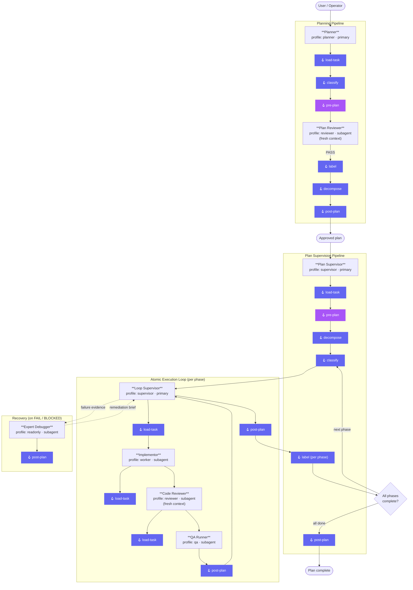

# Agent Fabric — System Architecture

This diagram shows how all eight built-in agents collaborate in the full planning → execution
lifecycle, including hook event fire points and delegation relationships.

## Full System Diagram

## Agent Role Summary

| Agent | Profile | Mode | Isolation | Hooks |
|---|---|---|---|---|
| [Planner](planner.md) | `planner` | primary | sandbox | load-task · classify · pre-plan · label · decompose · post-plan |
| [Plan Reviewer](plan-reviewer.md) | `reviewer` | subagent | sandbox | pre-plan |
| [Plan Supervisor](plan-supervisor.md) | `supervisor` | primary | workspace | load-task · classify · pre-plan · decompose · label · post-plan |
| [Loop Supervisor](loop-supervisor.md) | `supervisor` | primary | workspace | load-task · post-plan |
| [Implementor](implementor.md) | `worker` | subagent | sandbox | load-task |
| [Code Reviewer](code-reviewer.md) | `reviewer` | subagent | sandbox | load-task |
| [QA Runner](qa-runner.md) | `qa` | subagent | sandbox | post-plan |
| [Expert Debugger](expert-debugger.md) | `readonly` | subagent | sandbox | post-plan |

## Hook Event Reference

| Event | Registered by | Typical purpose |
|---|---|---|
| `load-task` | Planner · Plan Supervisor · Loop Supervisor · Implementor · Code Reviewer | Resolve task / brief from host task-system or context |
| `pre-plan` | Planner · Plan Supervisor · Plan Reviewer | Validation gate before planning or review begins |
| `classify` | Planner · Plan Supervisor | Route to destination / select next unblocked phase |
| `label` | Planner · Plan Supervisor | Apply task-system labels or state transitions |
| `decompose` | Planner · Plan Supervisor | Project child phases into task-system |
| `post-plan` | Plan Supervisor · Loop Supervisor · QA Runner · Expert Debugger | Signal completion / publish / notify |

Hooks are resolved once at install/sync time from `~/.agent-hooks/`. Markdown instructions
take precedence over executable scripts. When no hook is installed, agents continue without it.
